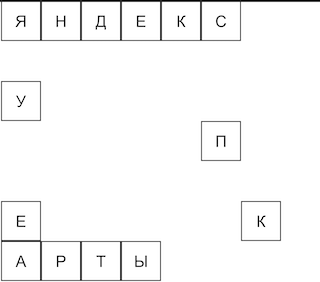
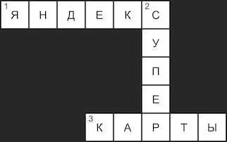

# Задачи из Яндекс.Контест для Яндекс Стажировки

### Содержание

* [А. Исследователи](#explorers)
* [В. Метеозонд](#meteosond)
* [С. Секретное сообщение](#secret)
* [D. Кроссворд](#crossword)

<a name="explorers">

## A. Исследователи (1 балл)

</a>

**Статус: Проверка пройдена**

Дан список, в которой хранятся исследователи и топонимы (имена мест) где они бывали. Список имеет следующий формат:

```javascript
    [  
        [<explorer1>, <toponym1>, <toponym2>, ...],  
        [<explorer2>, <toponym2>, <toponym3>, ...],  
        [<explorer3>, <toponym4>, <toponym1>, ...],  
        ...  
    ]
```

Надо развернуть этот список, таким образом, чтобы на первом месте оказался топоним, а на остальных исследователи.

### Формат ввода

```javascript
    [  
        ["Mallory", "Everest", "Mont Blanc", "Pillar Rock"],  
        ["Mawson", "South Pole", "New Hebrides"],  
        ["Hillary", "Everest", "South Pole"]  
    ]
```

### Формат вывода

```javascript
    [  
        ["Everest", "Hillary", "Mallory"],  
        ["South Pole", "Hillary", "Mawson"],  
        ["Mont Blanc", "Mallory"],  
        ["Pillar Rock", "Mallory"],  
        ["New Hebrides", "Mawson"]  
    ]
```

<a name="meteosond">

## B. Метеозонд (1 балл)

</a>

**Статус: Проверка пройдена**

Метеозонд отправляет данные с его смещениями по X и Y за последние N минут (N ≥ 1). За минуту зонд может сместиться на +/-1 по каждой координате или остаться на месте.
Аппаратура зонда сломалась и отправляет все значения координат без знаков (’+’ или ’-’). 
Проверьте существование комбинации знаков, для которых зонд вернулся на свое начальное положение.
На вход данные передаются как массив из N смещений. Каждое смещение имеет формат: [<diff_X>, <diff_Y>].
Ваша функция должна вернуть модифицированный массив смещений со знаками, для которых зонд вернулся в начальное положение, или null, если такой комбинации не существует.

### Формат ввода

```javascript
    [  
        [1, 0],  
        [0, 1],  
        [1, 1]  
    ]
```

### Формат вывода

```javascript
    [  
        [-1, 0],  
        [0, -1],  
        [1, 1]  
    ]
```

<a name="secret">

## C. Секретное сообщение (2 балла)

</a>

**Статус: Проверка не пройдена (проблема на 7-м тесте)**

На старой заброшенной базе геодезистов вы нашли код, который возвращает секретные послания, зашифрованные среди географических данных. Скрипт содержит несколько синтаксических ошибок и кажется работает очень медленно. Ваша задача - привести его в порядок.

### Формат ввода

```javascript
    const data = [  
        {  
            geometry: [10, 20],  
            text: ’James’  
        },  
        {  
            geometry: [20, 40],  
            text: ’Bond’  
        },  
        {  
            geometry: [5, 40],  
            text: ’Bond’  
        }  
    ];  
    const dictionary = [’James’, ’Bond’];
```

### Формат вывода

    Bond James Bond

### Примечания

В файле task.js описан метод, который принимает на вход два аргумента - data и dictionary. В переменной data передается массив объектов вида:

```javascript
    {  
        geometry: [number, number];  
        text: string;  
    }
```

В переменной dictionary передается массив строк - слова, которые мы умеем расшифровывать.

    dictionary: string[];

Чтобы получить секретное сообщение, требуется отсортировать все объекты из массива data по первой координате из поля geometry по возрастанию, а затем собрать в строку все поля text из отсортированного массива.
К сожалению, сообщение закодировано на иностранном языке, а переводчик знает только слова, заданные в переменной dictionary. Поэтому если в поле text встречается слово, которого нет в массиве dictionary, сообщение невозможно расшифровать.
Программа должна вернуть полученное сообщение или строку "Unreadable message"(в случае, если сообщение содержит слова, которых нет в словаре).
Решение необходимо предоставить в виде исправленого модуля.
Вердикт RE также означает, что отправленное решение неверно.

**Мой комментарий: Кавычки не при чем - проверено. Буду рад увидеть правильное решение**

<a name="crossword">

## D. Кроссворд (2 балла)

</a>

**Статус: Проверка пройдена**

После рефакторинга сломались CSS-стили в кроссворде:



Первоначальный дизайн:



Необходимо восстановить стили в соответствии с первоначальным дизайном, но сделать это нужно с минимальным количетсвом исправлений.

### Примечания
Текущие CSS-стили: solution.css.
После исправлений, нужно предоставить обновленный CSS-файл. Данный файл будет подключен как solution.css к HTML-странице.
Ваше решение будет тестироваться в браузере Google Chrome 69. Семейство и другие параметры шрифтов изменять не надо. При этом локально у вас может не совпадать шрифт с ожидаемым состоянием, т.к. скриншоты сделаны в Ubuntu.
Рекомендуем использовать плагины для pixel-perfect верстки, например, PerfectPixel.